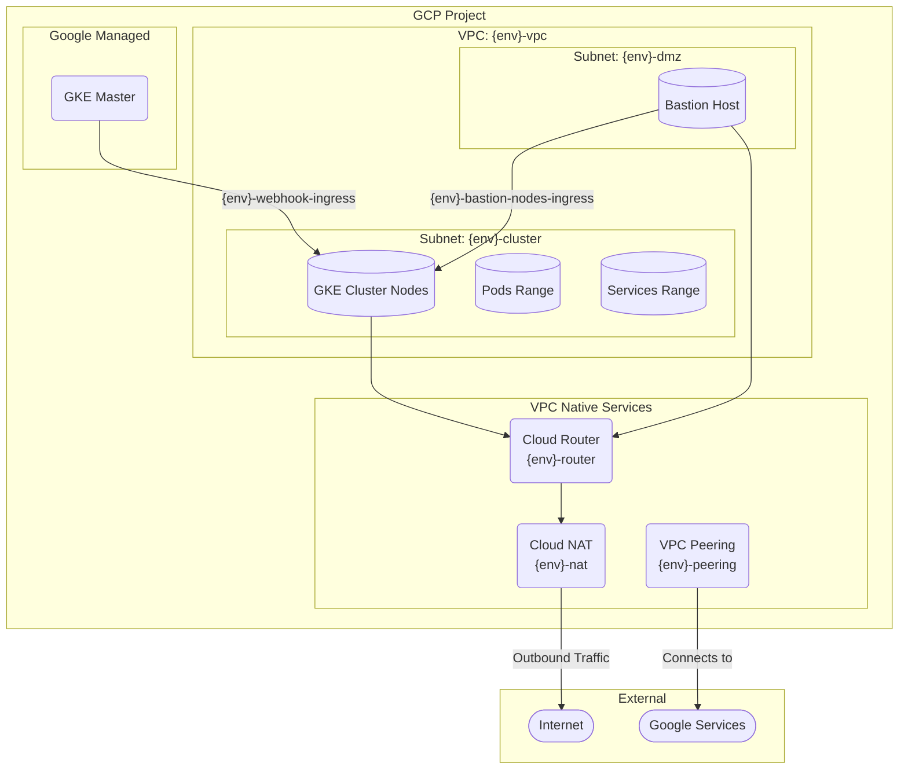

# galoy-infra

This repository contains [terraform](https://www.terraform.io) definitions to bring up a robust infrastructure implementation suitable for running the [galoy](https://github.com/GaloyMoney/galoy) stack.
It is production ready by default.

The infrastructure is organized into 4 modules that must be executed in sequence.
They can be executed against a completly blank google cloud project with `owner` access.
The final state is a regional gke cluster running on a private network with a bastion host deployed for connectivity.

## [modules](./modules)

- `bootstrap` - Enables required APIs and provisions the initial "inception" service account as well as the GCS bucket to store all terraform state required in all other phases. This step should be executed 1 time only and not automated.
- `inception` - Provisions all security sensitive resourced like the vpc network, bastion, roles, service accounts etc.
- `platform` - Provisions the gke cluster itself

The `bootstrap`, `inception` and `platform` modules currently only support GCP.
In the future additional versions of the first 3 modules will be developped to support other IaaSes.

The structure of the modules is intended to support continous delivery.
After initial deploy moving from 1 version to the next should always be smooth and automatable - albeit the sequence of the rollout should remain unchanged.

## Usage

The initial deploy - while it is automatable - does have a few caveats.
A complete walkthrough of a rollout is documented in the [examples/gcp](./examples/gcp) folder.

## K8s upgrade notes

K8s versions can be upgraded at `ci/k8s-upgrade/main.tf`.

Even though kubernetes themselves state that [they follow semantic versioning](https://kubernetes.io/releases/), `minor` versions may contain breaking changes, which is not in accordance to semantic versioning. Thus, unlike with dependencies that respect semantic versioning, `minor` upgrades must be done with care and supervision.

Given this, be aware that both `major` and `minor` version upgrades should be done one version at a time (to go from `1.30` to `1.32`, for example, first upgrade to `1.31`). And that, on each upgrade, you should let the version stream into our deployments and confirm everything works fine before moving on to a new version.

## Network diagram

