# PostgreSQL Migration Documentation

## Known Limitations
Before proceeding, please review the [known limitations](https://cloud.google.com/database-migration/docs/postgres/known-limitations) of the Database Migration Service (DMS).

# Step 1: Configure Source Instance
1. Select the Instance to Upgrade:
- Decide upon a instance to upgrade:

	- We are choosing the rishi-pg14-volcano-staging-pg-a34e9984 instance, a PostgreSQL 14 instance managed via the `galoy-infra/modules/postgresql/gcp` Terraform module.

  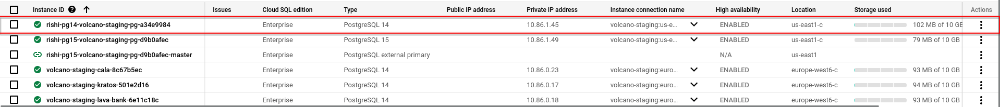

	- The source instance needs to be configured as [follows](https://cloud.google.com/database-migration/docs/postgres/configure-source-database#configure-your-source-instance-postgres)
    
    	- We use a conditional flag in the terraform `galoy-infra/modules/postgresql/gcp` [here](https://github.com/GaloyMoney/galoy-infra/pull/190) 

# Step 2: Create connection profile:
[**Connection Profile Reference**](https://cloud.google.com/database-migration/docs/postgres/create-source-connection-profile)

- A connection profile is configured via the terraform module mentioned above when we enable the `upgradable` flag.

# Step 3: Configure Connectivity
[**VPC-Peering Reference**](https://cloud.google.com/database-migration/docs/postgres/configure-connectivity-vpc-peering)

- For the connectivity we would be using the internal vpc that we already employ, so we don't need to do anything else.

# Step 4: Configure Destination
- Configure New PostgreSQL Instance:
	- **NOTE**: For simplicity keep the **prefix name** of source and destination same. 
	- Use this Terraform [module](https://github.com/k3yss/galoy-infra/tree/work/keys/expose-sql-credentials/examples/gcp/db_migration/pg15) for configuration.
	- You can also use create a new instance via the Database migration tool, but I find it a little confusing and complicated.

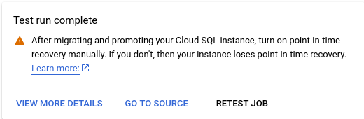
- This warning is probably irrevant for us, as we would be using terraform for the configuration. But something to look out **for**! 

# Step 5: Start Database Migration Process 

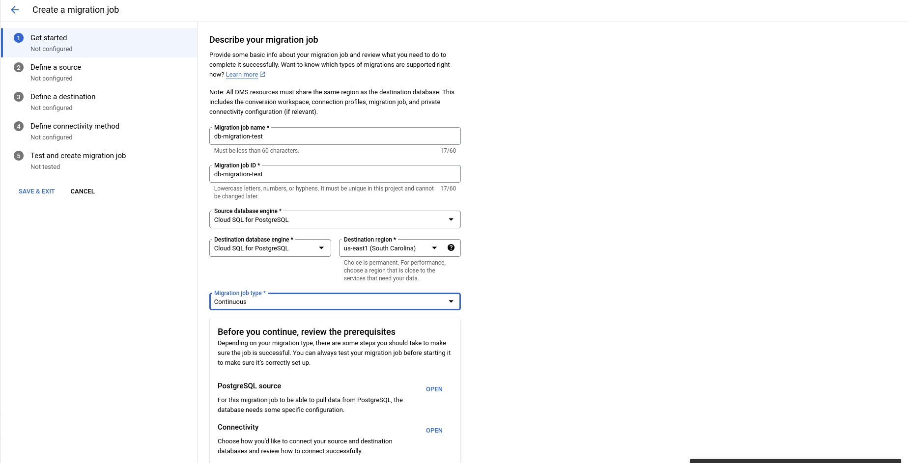
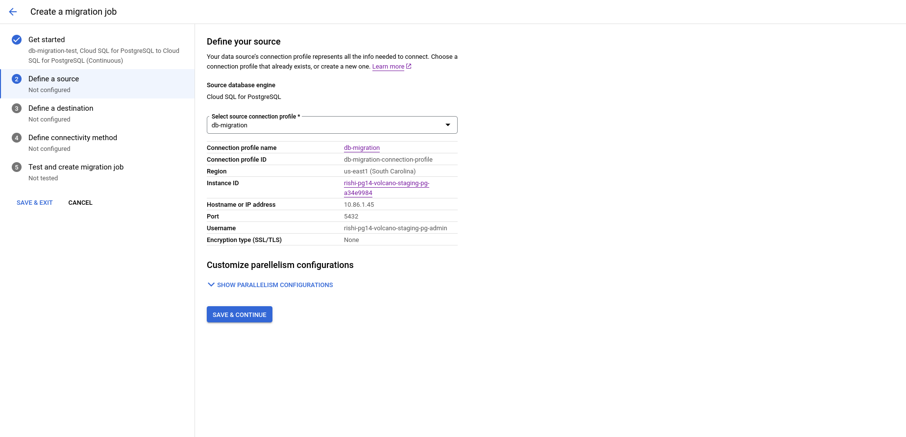
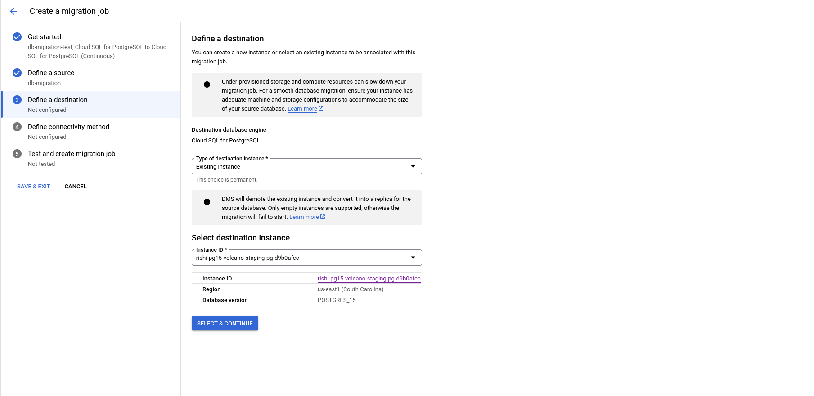
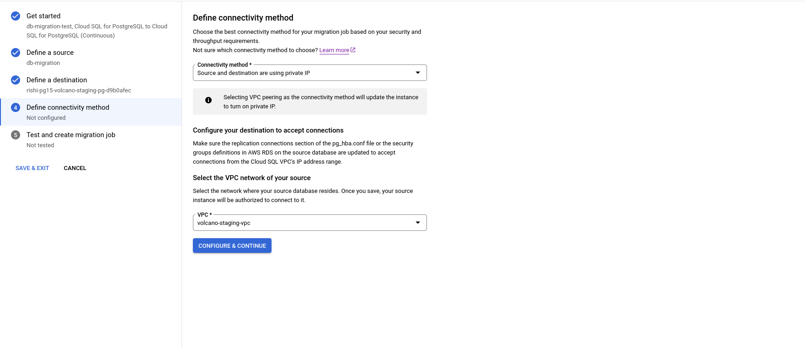
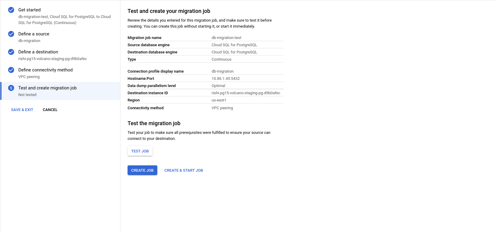
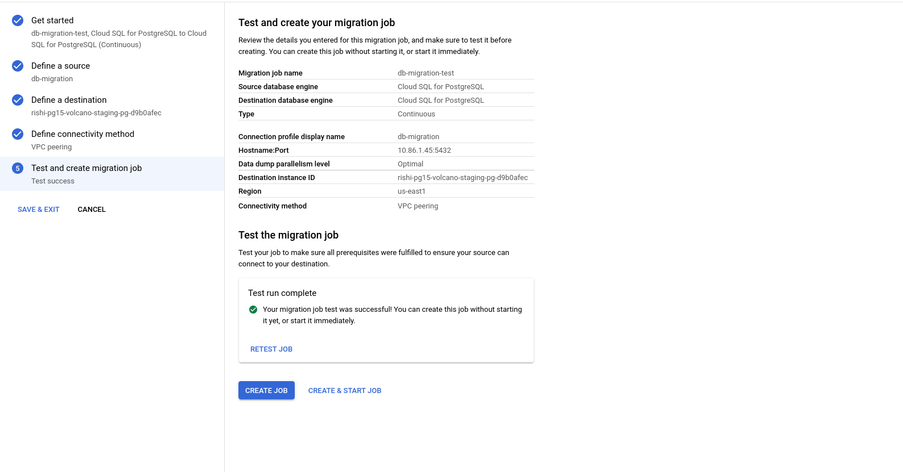

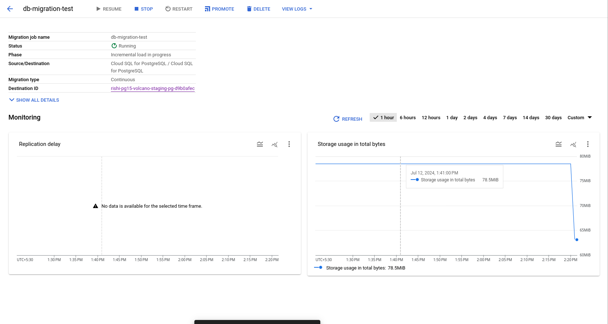

Once the replication delay is zero, promote the migration.

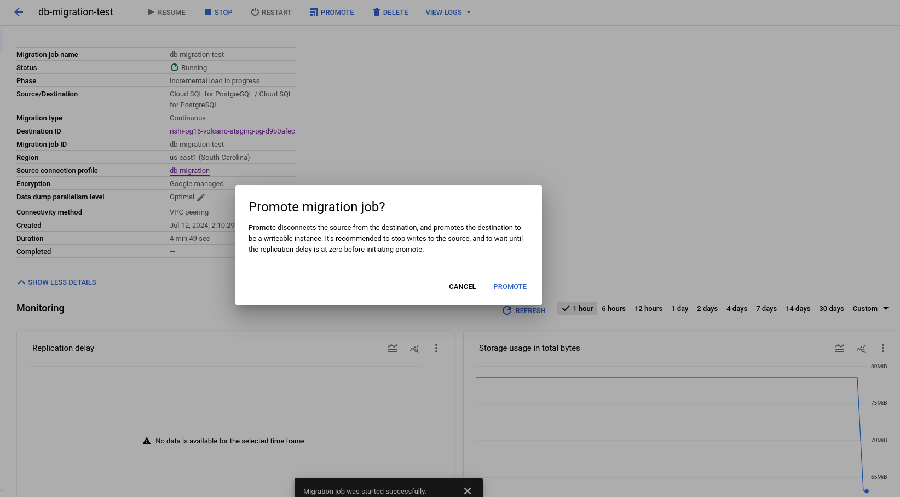
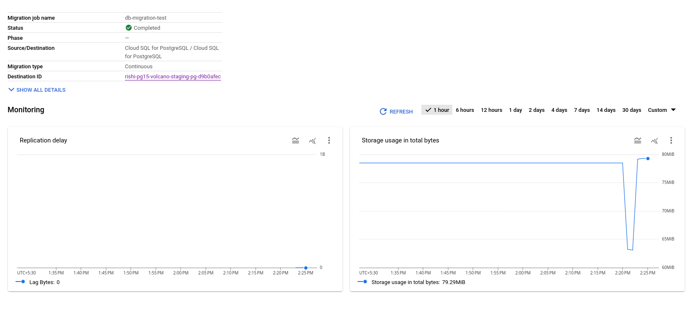

The Migration was successful.

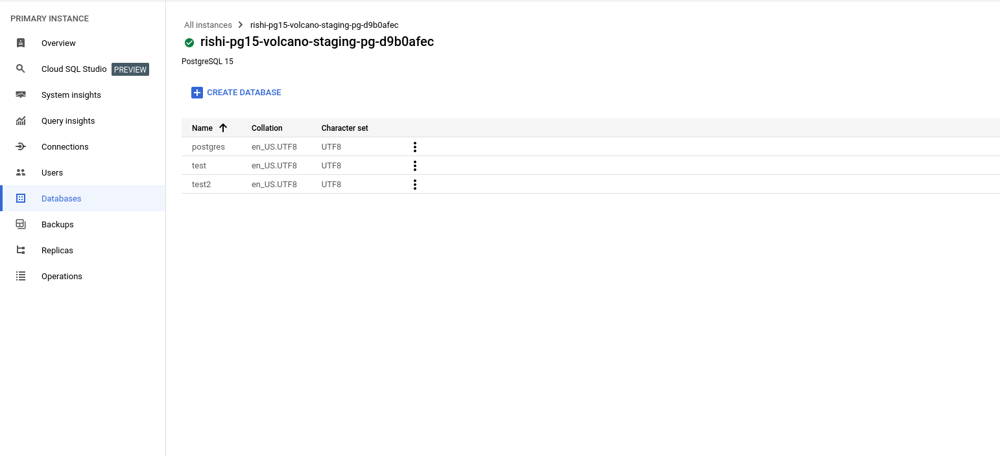

# Step 6: Post-Migration Steps

> Once you migrated the database using DMS all objects and schema owner will become ‘cloudsqlexternalsync’ by default.

1. Reassign Schema and Object Owners:
     - After migration, all objects and schema owners become cloudsqlexternalsync. Reassign the schema and object owners to match the source instance.
2. Migrate Users and Privileges:
   - Migration does not transfer privileges and users. Create users manually based on the old database.

# Step 7: Syncing with terraform

[TODO]
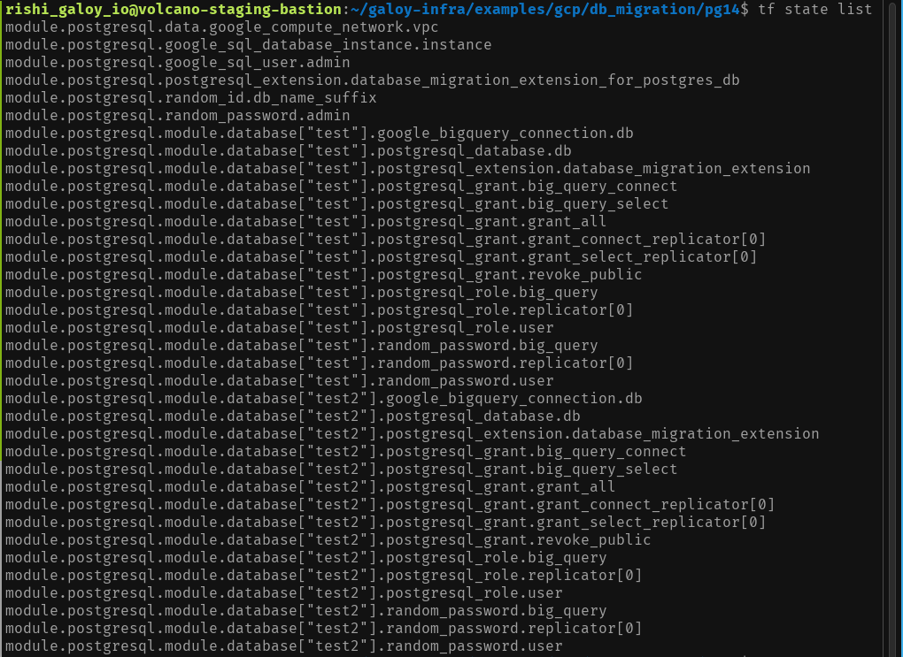