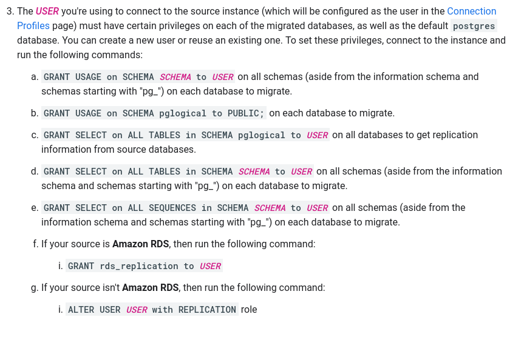

## NOTE: Please see the [known limitations](https://cloud.google.com/database-migration/docs/postgres/known-limitations) before proceeding further

# Step 1: Configure source
- Decide upon a instance to upgrade:
	- 

	- Here we are choosing a `rishi-pg14-volcano-staging-pg-a34e9984` which is a PG 14 instance which follows the `galoy-infra/modules/postgresql/gcp` terraform structure.

	- On the source instance we need to configure the following: [link](https://cloud.google.com/database-migration/docs/postgres/configure-source-database#configure-your-source-instance-postgres)
    
	- Managing it via terraform [here](https://github.com/k3yss/galoy-infra/tree/work/keys/expose-sql-credentials) 

	- The user must have the below permissions:
        
		For this I decided to use the admin user which seems to have all the permission except the replication role, which can be Granted via the following command:
		``ALTER USER "rishi-pg14-volcano-staging-pg-admin" with REPLICATION``

	-  **Restart your source instance** so that the configuration changes that you made to the flags can take effect.

# Step 2: Create connection profile:
[**Ref to create connection connect**](https://cloud.google.com/database-migration/docs/postgres/create-source-connection-profile)

- A terraform configuration to do this can be found [here](https://github.com/k3yss/galoy-infra/tree/work/keys/expose-sql-credentials/examples/gcp/db_migration/connection_profile)
	- Populate the following variables:
	```
	postgres_host = "<database-ip>"  
	postgres_user_name = "rishi-pg14-volcano-staging-pg-admin"  
	postgres_password = "<database-password>"  
	postgres_port = "<database-port>"  
	cloud_sql_id = "rishi-pg14-volcano-staging-pg-a34e998
	```
	- Do a `terraform apply -var-file=variable.tfvars`

# Step 3: Connectivity
[**VPC REF**](https://cloud.google.com/database-migration/docs/postgres/configure-connectivity-vpc-peering)
- For the connectivity we would be using the internal vpc that we already have


# Step 4: Configure destination
This is just a new `postgres` destination which can be configured using [this custom](https://github.com/k3yss/galoy-infra/tree/work/keys/expose-sql-credentials/examples/gcp/db_migration/pg15) terraform module: 


# Step 5: 
Start the database migration process using the DMS:


After replication delay is zero we can begin the promotion, since the test was done with a database which had no data, their is no replication delay.


![[./assets/Pasted image 20240712142921.png]]

### The database has been migrated successfully.


# Step 6: 
> Once you migrated the database using DMS all objects and schema owner will become ‘cloudsqlexternalsync’ by default, if you need schema and objects owner same as source please follow below steps:

The migration doesn't transfer privileges and users, so we would need to create new users manually using the old database as a reference.  

[**User migration scripts ref**](https://medium.com/google-cloud/migrate-users-with-credentials-from-cloudsql-to-another-instance-or-alloydb-for-postgresql-e377a222d3f8)
[**Privilage_migration_script ref**](https://medium.com/google-cloud/migrate-grants-and-reassign-owner-in-alloydb-for-postgresql-post-dms-610393731024)

## Migrate users

`PGPASSWORD=<database-password> psql -h <database-ip> -U postgres -t -c "select 'alter user \"' || usename || '\" with encrypted password ' || quote_literal(passwd) || ';' from pg_shadow where usename not like 'cloudsql%'" | PGPASSWORD=<database-password> psql -h 10.86.1.49 -U postgres

`PGPASSWORD=<database-password> pg_dumpall -h <database-ip> -U postgres -r --no-role-passwords | sed '/cloudsqladmin/d;/cloudsqlagent/d;/cloudsqliamserviceaccount/d;/cloudsqliamuser/d;/cloudsqlimportexport/d;/cloudsqlreplica/d;/cloudsqlsuperuser/d;s/NOSUPERUSER//g' | PGPASSWORD=<database-password> psql -h 10.86.1.49 -U postgres
`

## Grant priviliges

`PGPASSWORD=<database-password> pg_dumpall -h <database-ip> -U postgres  --exclude-database="alloydbadmin|cloudsqladmin|rdsadmin" --schema-only --no-role-passwords  | sed '/cloudsqladmin/d;/cloudsqlagent/d;/cloudsqliamserviceaccount/d;/cloudsqliamuser/d;/cloudsqlimportexport/d;/cloudsqlreplica/d;/cloudsqlsuperuser/d;s/NOSUPERUSER//g' | grep -E '^(GRANT|REVOKE|\\connect|ALTER.*OWNER.*|CREATE ROLE|ALTER ROLE)' | PGPASSWORD=<database-password> psql -h 10.86.1.49 -U postgres
`


# Step 7: Syncing with terraform

[TODO]
