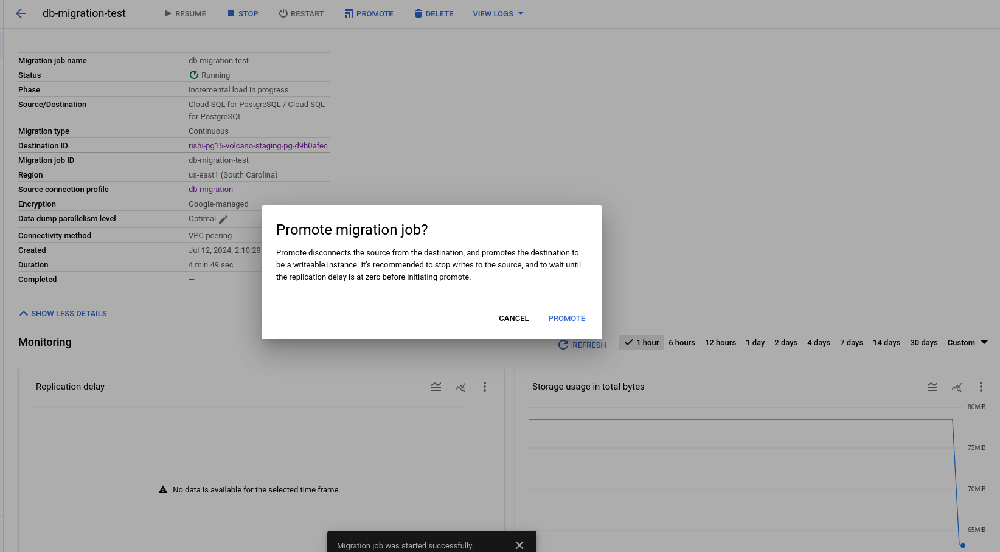
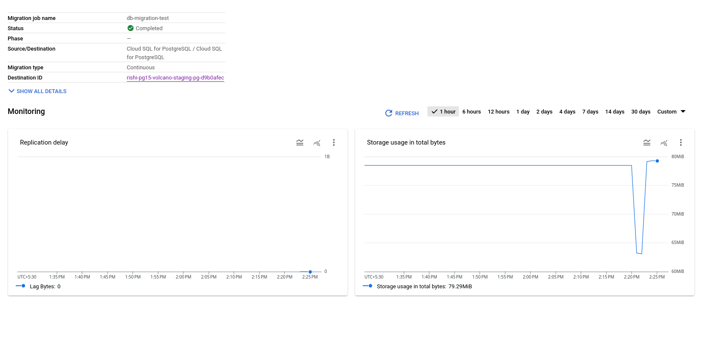
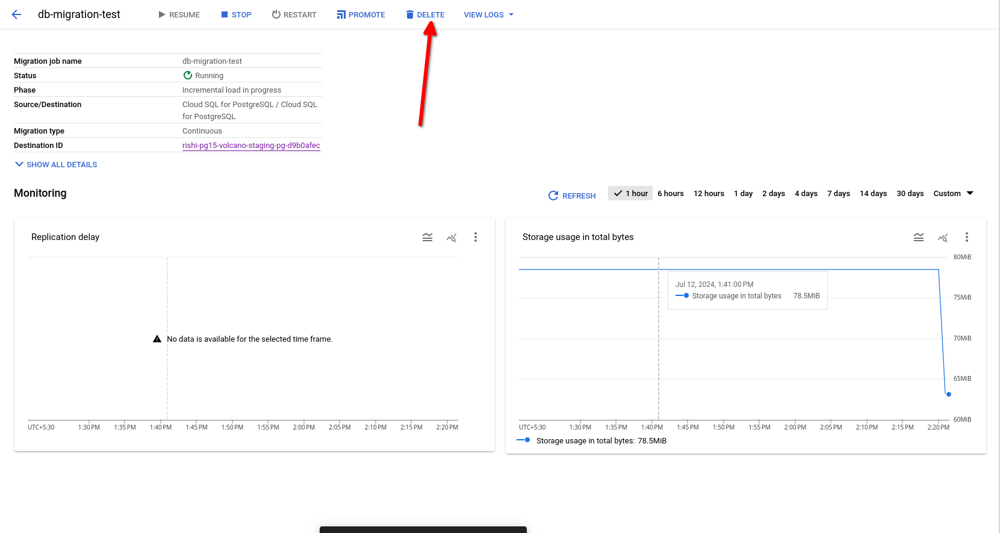
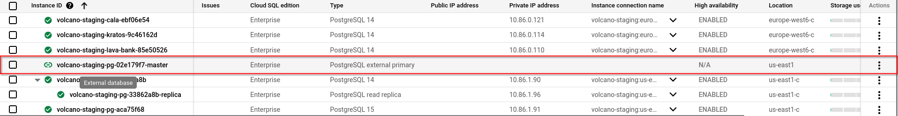

# PostgreSQL Migration Documentation

### Known Limitations
Before proceeding, please review the [known limitations](https://cloud.google.com/database-migration/docs/postgres/known-limitations) of the Database Migration Service (DMS).

# Step 1: Configure Source Instance and create connection profile
- Decide upon a instance to upgrade:

	- We are choosing the `rishi-pg14-volcano-staging-pg-a34e9984` instance, a PostgreSQL 14 instance managed via the `galoy-infra/modules/postgresql/gcp` Terraform module.

  

- On the terraform file of the decided instance, enable the `prep_upgrade_as_source_db` flag

```hcl
module "postgresql_migration_source" {  
source = "git::https://github.com/GaloyMoney/galoy-infra.git//modules/postgresql/gcp?ref=<git_reference>"  
# source = "../../../modules/postgresql/gcp"  
  
instance_name          = "${var.name_prefix}-pg"  
vpc_name               = "${var.name_prefix}-vpc"  
gcp_project            = var.gcp_project  
destroyable            = var.destroyable_postgres  
user_can_create_db     = true  
databases              = ["test"]  
replication            = true  
provision_read_replica = true  
database_version       = "POSTGRES_14"  
// Enable it as follows
prep_upgrade_as_source_db   = true
}
```

The `prep_upgrade_as_source_db` flag configures the source database, initialises a new postgres destination and creates a connection profile with the migration user as required by the Database Migration Service.

- ** The full specification of how the source instance needs to be configured can be found [Here](https://cloud.google.com/database-migration/docs/postgres/configure-source-database#configure-your-source-instance-postgres)
- **  The specification for connection profile can be found [here](https://cloud.google.com/database-migration/docs/postgres/create-source-connection-profile)

# Step 2: Start Database Migration Process 

> Reference for [Database Migration Service](https://cloud.google.com/sdk/gcloud/reference/database-migration/migration-jobs)

```sh
$ gcloud database-migration migration-jobs create (MIGRATION_JOB : --region=REGION) --destination=DESTINATION --source=SOURCE --type=TYPE [--no-async] [--commit-id=COMMIT_ID] [--conversion-workspace=CONVERSION_WORKSPACE] [--display-name=DISPLAY_NAME] [--dump-parallel-level=DUMP_PARALLEL_LEVEL] [--dump-path=DUMP_PATH] [--dump-type=DUMP_TYPE] [--filter=FILTER] [--labels=[KEY=VALUE,…]] [--cmek-key=CMEK_KEY : --cmek-keyring=CMEK_KEYRING --cmek-project=CMEK_PROJECT] [--peer-vpc=PEER_VPC     | --static-ip     | [--vm-ip=VM_IP --vm-port=VM_PORT --vpc=VPC : --vm=VM]] [--sqlserver-databases=databaseName,[…] : --sqlserver-encrypted-databases=SQLSERVER_ENCRYPTED_DATABASES] [GCLOUD_WIDE_FLAG …]

$ gcloud database-migration migration-jobs create <db-migration-name> --region=<your-region> --source=<source-name> --destination=<destination-name> --type=CONTINUOUS 
$ gcloud database-migration migration-jobs verify MIGRATION_JOB --region=us-central1
$ gcloud database-migration migration-jobs start MIGRATION_JOB --region=us-central1
```
# Step 3: Pre-promotion 

- You should verify if all the data has migrated successfully, a generic guide to do it can be found [here](https://cloud.google.com/database-migration/docs/postgres/quickstart#verify_the_migration_job) 

>    -  Migration does not transfer privileges and users. Create users manually based on the old database.
>    - Once you migrated the database using DMS all objects and schema owner will become `cloudsqlexternalsync` by default.

### Step 3.5: Handing the non-migrated settings and syncing state via `terraform`

#### Step 3.5.1
- Log in to the `destination instance` as the `postgres` user and change the name of the `cloudsqlexternalsync` user to the **`<database-admin-user>`** that we deleted earlier, so that we can use that to connect to the database:

```sql
ALTER USER "cloudsqlexternalsync" RENAME TO "<database-admin-user>";
```

Also, via the `google cloud console`, assign a password for the admin user, for simplicity you can keep it the same as the source instance so you don't have to handle imports, the further guide assumes you have used the same password.

#### Step 3.5.2

Modify your source destination's `main.tf` to reflect the new destination instance by changing:
- Change the `database_version` to `"POSTGRES_15"` and
- Set the `prep_upgrade_as_source_db` to `false` or remove the `prep_upgrade_as_source_db` as by default it has the `false` value 
- Set `pre_promotion` to `true`, as we need the backups disabled; (we need to enable them later):

```hcl
module "postgresql" {
  #source = "git::https://github.com/GaloyMoney/galoy-infra.git//modules/postgresql/gcp?ref=689daa7"
  source = "../../../modules/postgresql/gcp"

  instance_name          = "rishi-pg"
  vpc_name               = "${var.name_prefix}-vpc"
  gcp_project            = var.gcp_project
  destroyable            = var.destroyable_postgres
  user_can_create_db     = true
  databases              = ["test"]
  highly_available       = false
  replication            = true
  // version change
  database_version       = "POSTGRES_15"
  # We can enable this flag now
  provision_read_replica = true
  # We still need the backups disabled as the instance is a read-replica
  pre_promotion          = true
}
```

#### Step 3.5.3
Manipulate the old state to reflect the new state by running the two scripts located at `galoy-infra/examples/gcp/bin`

```sh
$ ./terraform-db-swap.sh
# This will ask for your terraform module name
# And swap the state between the newer and old instance
$ ./terraform-state-rm.sh
# This will ask for your terraform module name, give it the same name as you gave before
# This will remove all the conflicting state which terraform will try to remove manually
```


#### Step 3.5.4 

Finally, do a 

```sh
terraform apply
```
The destination instance should be exactly as with the source PostgreSQL instance, expect backups which we will enable after promotion, and database artifacts which we will fix in the next step.


#### Step 3.5.5 

Change the owners of the tables and schemas to the correct owner using the psql command:

```sh
#TODO after the dry run

```

# Step 5: Promote the instance
Now go to the Database Migration Service and once the replication delay is zero, promote the migration.




#### The Migration was successful.


# Step 6: Enable backup
Disable `pre_promotion` flag, 

```hcl
module "postgresql" {
  #source = "git::https://github.com/GaloyMoney/galoy-infra.git//modules/postgresql/gcp?ref=689daa7"
  source = "../../../modules/postgresql/gcp"

  instance_name          = "rishi-pg"
  vpc_name               = "${var.name_prefix}-vpc"
  gcp_project            = var.gcp_project
  destroyable            = var.destroyable_postgres
  user_can_create_db     = true
  databases              = ["test"]
  highly_available       = false
  database_version       = "POSTGRES_15"
  replication            = true
  provision_read_replica = true
  # Enable backups now
  pre_promotion          = false # <-we can also remove this line completely
}
```
Do a `terraform apply`

# Step 7: Delete all the dangling resources 

- Delete the Database Migration Service that we used for migration.

- Delete the external-replica that was used for performing the replication.

- Delete the rest of the resources, which includes:
  -  source instance
  -  connection-profile
  
  You can delete them manually by going to [connection profile console](https://console.cloud.google.com/dbmigration/connection-profiles) and [cloud sql console](https://console.cloud.google.com/sql/instances)
  
  or 
  
  use the backed-up state from earlier and do a `terraform destroy` on it to destroy the resources. (While testing it was found that the first method was faster and less error prone)
