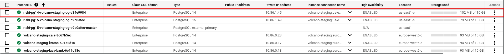
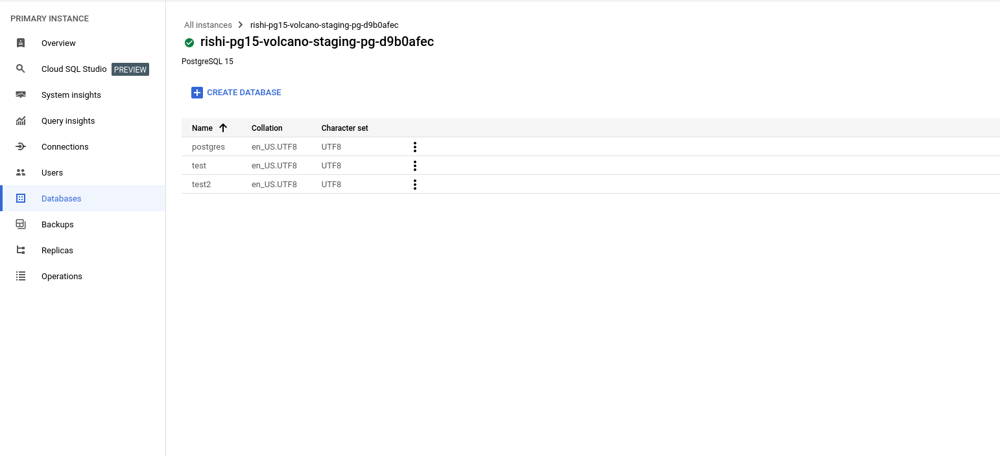

# PostgreSQL Migration Documentation

### Known Limitations
Before proceeding, please review the [known limitations](https://cloud.google.com/database-migration/docs/postgres/known-limitations) of the Database Migration Service (DMS).

# Step 1: Configure Source Instance and create connection profile
- Decide upon a instance to upgrade:
	- We are choosing the `rishi-pg14-volcano-staging-pg-a34e9984` instance, a PostgreSQL 14 instance managed via the `blink-infra/modules/postgresql/gcp` Terraform module.
  
- On the tofu file of the decided instance, enable the `prep_upgrade_as_source_db` flag

```hcl
module "postgresql_migration_source" {
source                      = "git::https://github.com/blinkbitcoin/blink-infra.git//modules/postgresql/gcp?ref=<git_reference>"
# source = "../../../modules/postgresql/gcp"

instance_name               = "${var.name_prefix}-pg"
vpc_name                    = "${var.name_prefix}-vpc"
gcp_project                 = var.gcp_project
destroyable                 = var.destroyable_postgres
user_can_create_db          = true
databases                   = ["test"]
replication                 = true
provision_read_replica      = true
database_version            = "POSTGRES_14"
// Enable it as follows
prep_upgrade_as_source_db   = true
}
```

The `prep_upgrade_as_source_db` flag configures the source database, initialises a new postgres destination and creates two connection profiles for source and destination as required by the Database Migration Service.

Also add the following outputs which we will require in the future steps:

```sh
output "source_connection_profile_id" {
    value       = <module-name>.connection_profile_credentials["source_connection_profile_id"]
}

output "destination_connection_profile_id" {
    value       = <module-name>.connection_profile_credentials["destination_connection_profile_id"]
}

output "vpc" {
    value       = <module-name>.vpc
}

output "migration_destination_instance" {
    value       = <module-name>.migration_destination_instance
    sensitive   = true
}

output "source_instance" {
    value       = <module-name>.source_instance["conn"]
    sensitive   = true
}

output "migration_sql_command" {
    value       = <module-name>.migration_sql_command
    sensitive   = true
}
```

Run:

```sh
$ tofu apply
```

- ** The full specification of how the source instance needs to be configured can be found [Here](https://cloud.google.com/database-migration/docs/postgres/configure-source-database#configure-your-source-instance-postgres)
- **  The specification for connection profile can be found [here](https://cloud.google.com/database-migration/docs/postgres/create-source-connection-profile)

# Step 2: Start Database Migration Process

> Reference for [Database Migration Service](https://cloud.google.com/sdk/gcloud/reference/database-migration/migration-jobs)

Before proceeding with the DMS creation we will expose the required things by gcloud using the `output` block, add these output blocks to your main tofu file.
```sh
# run the create-dms.sh script located in modules/postgresql/gcp/bin
# <output-prefix> to be used for output automation 
# this is the module name of the current project we are performing migration
$ ./create-dms.sh <main.tf directory> <gcp-project-name> <gcp-region> <dms-migration-job-name> <output-prefix>
Enter the region: us-east1
Enter the job name: test-migration
Creating migration job 'test-migration' in region 'us-east1'...
done: true
metadata:
'@type': type.googleapis.com/google.cloud.clouddms.v1.OperationMetadata
apiVersion: v1
createTime: '2024-08-28T07:43:20.081378163Z'
endTime: '2024-08-28T07:43:20.193064462Z'
requestedCancellation: false
target: projects/volcano-staging/locations/us-east1/migrationJobs/test-migration
verb: create
name: projects/volcano-staging/locations/us-east1/operations/operation-1724830999734-620b983096922-b2c351ac-6becb172
response:
'@type': type.googleapis.com/google.cloud.clouddms.v1.MigrationJob
createTime: '2024-08-28T07:43:20.078546769Z'
destination: projects/volcano-staging/locations/us-east1/connectionProfiles/volcano-staging-pg-f148f0c5-id
destinationDatabase:
engine: POSTGRESQL
provider: CLOUDSQL
displayName: test-migration
duration: 0.105832s
name: projects/volcano-staging/locations/us-east1/migrationJobs/test-migration
source: projects/volcano-staging/locations/us-east1/connectionProfiles/volcano-staging-pg-2ac106b8-id
sourceDatabase:
engine: POSTGRESQL
provider: CLOUDSQL
state: NOT_STARTED
type: CONTINUOUS
updateTime: '2024-08-28T07:43:20.176407Z'
vpcPeeringConnectivity:
vpc: projects/volcano-staging/global/networks/volcano-staging-vpc
Migration job 'test-migration' created successfully.
Demoting the destination for migration job 'test-migration'...
done: false
metadata:
'@type': type.googleapis.com/google.cloud.clouddms.v1.OperationMetadata
apiVersion: v1
createTime: '2024-08-28T07:43:22.585543514Z'
requestedCancellation: false
target: projects/volcano-staging/locations/us-east1/migrationJobs/test-migration
verb: demoteDestination
name: projects/volcano-staging/locations/us-east1/operations/operation-1724831002232-620b9832f8593-11ca0f93-e8a4c2c1
Migration job 'test-migration' has started demoting the destination instance.

The destination instance is being demoted. Run the following command after the process has completed:

# The script will specify which command you need to run after the demotion is completed.
$ gcloud database-migration migration-jobs start "test-migration" --region="us-east1"
```

> Run the start command that is prompted

```sh
$ gcloud database-migration migration-jobs start "test-migration" --region="us-east1"

# Use the describe command to check the status of the migration-job !IMPORTANT
$ gcloud database-migration migration-jobs describe "test-job" --region=us-east1


## NOTE:

BEFORE PROMOTING VERIFY THAT THE DMS HAS BEEN SUCCESSFUL BY RUNNING THE `describe` command from earlier.

```
# Step 3: Pre-promotion

- You should verify if all the data has migrated successfully, a generic guide to do it can be found [here](https://cloud.google.com/database-migration/docs/postgres/quickstart#verify_the_migration_job)

>    -  Migration does not transfer privileges and users. Create users manually based on the old database.
>    - Once you migrated the database using DMS all objects and schema owner will become `cloudsqlexternalsync` by default.

### Step 3.5: Handing the non-migrated settings and syncing state via `tofu`

#### Step 3.5.1
- Log in to the `destination instance` as the `postgres` user.
- Change the name of the `cloudsqlexternalsync` user to the `<admin-user>`.
- The commands to do this can be found by running the following command:

```sh
# get the <admin-user> value here
$ tf output -json migration_sql_command 
```

#### Step 3.5.2
Manipulate the old state to reflect the new state by running the two scripts located at `blink-infra/examples/gcp/bin`

```sh
$ ./terraform-db-swap.sh <main.tf directory> <module-name>
# This will ask for your tofu module name
# And swap the state between the newer and old instance
$ ./terraform-state-rm.sh <main.tf directory> <module-name>
# This will ask for your tofu module name, give it the same name as you gave before
# This will remove all the conflicting state which tofu will try to remove manually
```
#### Step 3.5.3

Modify your source destination's `main.tf` to reflect the new destination instance by changing:
- Change the `database_version` to `"POSTGRES_15"` and
- Set the `prep_upgrade_as_source_db` to `false` or remove the `prep_upgrade_as_source_db` as by default it has the `false` value
- Set `pre_promotion` to `true`, as we need the backups disabled; (we need to enable them later):

```hcl
module "postgresql" {
  #source = "git::https://github.com/blinkbitcoin/blink-infra.git//modules/postgresql/gcp?ref=689daa7"
  source = "../../../modules/postgresql/gcp"

  instance_name          = "test-pg"
  vpc_name               = "${var.name_prefix}-vpc"
  gcp_project            = var.gcp_project
  destroyable            = var.destroyable_postgres
  user_can_create_db     = true
  databases              = ["test"]
  highly_available       = false
  replication            = true
  // version change
  database_version       = "POSTGRES_15"
  # We can enable this flag now
  provision_read_replica = true
  # We still need the backups disabled as the instance is a read-replica
  pre_promotion          = true
}
```

#### Step 3.5.4

Finally, do a

```sh
$ tofu apply
```
The destination instance should be exactly as with the source PostgreSQL instance, expect backups which we will enable after promotion, and database artifacts which we will fix in the next step.


#### Step 3.5.5

Change the owners of the tables and schemas to the correct owner using the psql command:

Get the promoted instance PG15 connection string by running
```sh
$ tofu output --raw source_instance > pg_connection.txt
```

```sh
#TODO | Need to do a dry run again
$ ./postgres-perms-update.sh <main.tf directory> <db-name-whose-perms-we-want-to-be-fixed>
```

# Step 4: Promote the instance
Now go to the [Database Migration Service](https://console.cloud.google.com/dbmigration/migrations) and once the replication delay is zero, promote the migration.

```sh
$ gcloud database-migration migration-jobs promote test-job --region=us-east1
```

#### The Migration was successful.



# Step 5: Enable backup
Disable `pre_promotion` flag,

```hcl
module "postgresql" {
  #source = "git::https://github.com/blinkbitcoin/blink-infra.git//modules/postgresql/gcp?ref=689daa7"
  source = "../../../modules/postgresql/gcp"

  instance_name          = "test-pg"
  vpc_name               = "${var.name_prefix}-vpc"
  gcp_project            = var.gcp_project
  destroyable            = var.destroyable_postgres
  user_can_create_db     = true
  databases              = ["test"]
  highly_available       = false
  database_version       = "POSTGRES_15"
  replication            = true
  provision_read_replica = true
  # Enable backups now
  pre_promotion          = false # <-we can also remove this line completely
}
```
Do a `tofu apply`

# Step 6: Delete all the dangling resources

### Delete the Database Migration Service that we used for migration.
```sh
$ gcloud database-migration migration-jobs delete "test-job" --region=us-east1
```

### Delete the source and external replica instance
```sh
$  gcloud sql instances list
# you might also need to disable the deletion protection
$  gcloud sql instances delete <source-instance-id>
$  gcloud sql instances delete <external-replica-instance-id>
```

### Delete the source connection profile
```sh
$ gcloud database-migration connection-profiles list

# See the output and determine the connection profile you want to delete
$ gcloud database-migration connection-profiles  delete <CONNECTION_PROFILE_ID> --region=<REGION>
```
