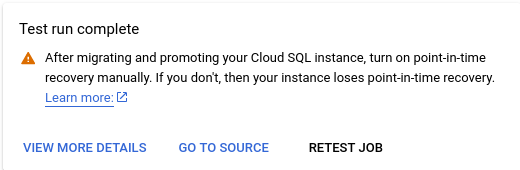

# PostgreSQL Migration Documentation


## Known Limitations
Before proceeding, please review the [known limitations](https://cloud.google.com/database-migration/docs/postgres/known-limitations) of the Database Migration Service (DMS).

# Step 1: Configure Source Instance
1. Select the Instance to Upgrade:
- Decide upon a instance to upgrade:

	- We are choosing the rishi-pg14-volcano-staging-pg-a34e9984 instance, a PostgreSQL 14 instance managed via the `galoy-infra/modules/postgresql/gcp` Terraform module.

  

	- The source instance needs to be configured as [follows](https://cloud.google.com/database-migration/docs/postgres/configure-source-database#configure-your-source-instance-postgres)
    
    	- We use a conditional flag in the terraform `galoy-infra/modules/postgresql/gcp` [here](https://github.com/GaloyMoney/galoy-infra/pull/190) 


# Step 2: Create connection profile:
[**Connection Profile Reference**](https://cloud.google.com/database-migration/docs/postgres/create-source-connection-profile)

- A connection profile is configured via the terraform module mentioned above when we enable the `upgradable` flag.


# Step 3: Configure Connectivity
[**VPC-Peering Reference**](https://cloud.google.com/database-migration/docs/postgres/configure-connectivity-vpc-peering)

- For the connectivity we would be using the internal vpc that we already employ, so we don't need to do anything else.


# Step 4: Configure Destination
- Configure New PostgreSQL Instance:
	- **NOTE**: For simplicity keep the **prefix name** of source and destination same. 
	- Use this Terraform [module](https://github.com/k3yss/galoy-infra/tree/work/keys/expose-sql-credentials/examples/gcp/db_migration/pg15) for configuration.
	- You can also use create a new instance via the Database migration tool, but I find it a little confusing and complicated.


- This warning is probably irrevant for us, as we would be using terraform for the configuration. But something to look out **for**! 

# Step 5: Start Database Migration Process 


Once the replication delay is zero, promote the migration.


The Migration was successful.


# Step 6: Post-Migration Steps

- [Verify Migration Job](https://cloud.google.com/database-migration/docs/postgres/quickstart#verify_the_migration_job) 

> Once you migrated the database using DMS all objects and schema owner will become ‘cloudsqlexternalsync’ by default.

1. Reassign Schema and Object Owners:
     - After migration, all objects and schema owners become cloudsqlexternalsync. Reassign the schema and object owners to match the source instance.
2. Migrate Users and Privileges:
   - Migration does not transfer privileges and users. Create users manually based on the old database.

# Step 6.5: Terraform state sync and user creation

## Method 1
This method requires some downtime as we will promote the instance first. Once the migration is completed, promote your instance and follow the steps below to sync the Terraform state.

### Step 1
Log in to the destination instance as the `postgres` user and change the name of the `cloudsqlexternalsync` user to your source database admin name:

```sql
ALTER USER "cloudsqlexternalsync" RENAME TO "<admin-user-name>";
```

### Step 2
Modify your `main.tf` to reflect the new destination instance by changing the `database_version`:

```hcl
variable "name_prefix" {}
variable "gcp_project" {}
variable "destroyable_postgres" {
  default = true
}

module "postgresql" {
  #source = "git::https://github.com/GaloyMoney/galoy-infra.git//modules/postgresql/gcp?ref=689daa7"
  source = "../../../modules/postgresql/gcp"

  instance_name          = "rishi-pg"
  vpc_name               = "${var.name_prefix}-vpc"
  gcp_project            = var.gcp_project
  destroyable            = var.destroyable_postgres
  user_can_create_db     = true
  databases              = ["test"]
  highly_available       = false
  database_version       = "POSTGRES_15"
  replication            = false
  provision_read_replica = false
  upgradable             = false
}
```

### Step 3
Remove the state of the old instance. Below is the list of states to remove when the source instance has only one database named `test`:

```sh
terraform state rm module.postgresql.module.database[\"test\"]
terraform state rm module.postgresql.google_database_migration_service_connection_profile.connection_profile[0]
terraform state rm module.postgresql.random_password.migration[0]
terraform state rm module.postgresql.google_sql_database_instance.instance
terraform state rm $(terraform state list | grep module.postgresql.postgresql_grant)
terraform state rm module.postgresql.postgresql_extension.pglogical[0]
terraform state rm module.postgresql.random_id.db_name_suffix
terraform state rm module.postgresql.google_sql_user.admin
```

Final state:
```sh
terraform state list
module.postgresql.data.google_compute_network.vpc
module.postgresql.random_password.admin
```

### Step 4
Create an `import.tf` file with the following content:

```hcl
import {
  to = module.postgresql.random_id.db_name_suffix
  id = "<b64_url of your db_name_suffix>"
}

import {
  to = module.postgresql.google_sql_database_instance.instance
  id = "projects/volcano-staging/instances/<instance-name>"
}

import {
  to = module.postgresql.module.database["test"].postgresql_database.db
  id = "test"
}
```

> To generate `db_name_suffix`, run:
> ```sh
> echo "<db-suffix>" | xxd -r -p | base64 | tr '/+' '_-' | tr -d '='
> ```

### Step 3 

Finally, do a 

```sh
tf apply
```
and the state should be synced with the new PostgreSQL instance.
