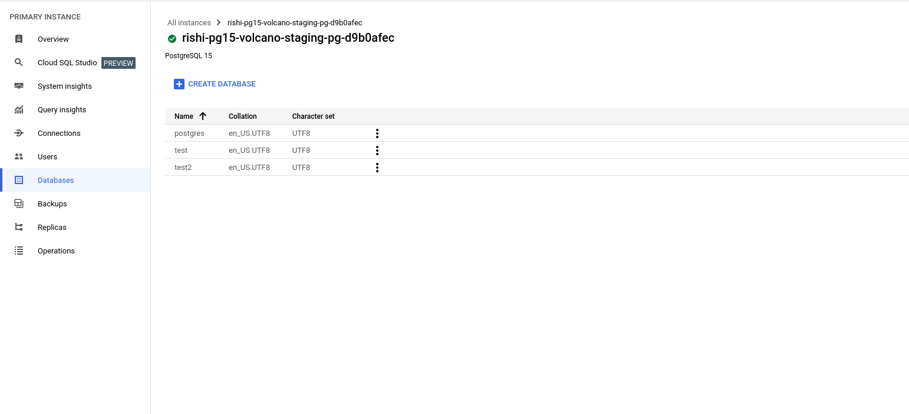

# PostgreSQL Migration Documentation

### Known Limitations
Before proceeding, please review the [known limitations](https://cloud.google.com/database-migration/docs/postgres/known-limitations) of the Database Migration Service (DMS).

# Step 1: Configure Source Instance and create connection profile
- Decide upon a instance to upgrade:

	- We are choosing the `rishi-pg14-volcano-staging-pg-a34e9984` instance, a PostgreSQL 14 instance managed via the `galoy-infra/modules/postgresql/gcp` Terraform module.

  

- On the terraform file of the decided instance, enable the `source_db_upgradable` flag

```hcl
module "postgresql_migration_source" {  
source = "git::https://github.com/GaloyMoney/galoy-infra.git//modules/postgresql/gcp?ref=<git_reference>"  
# source = "../../../modules/postgresql/gcp"  
  
instance_name          = "${var.name_prefix}-pg"  
vpc_name               = "${var.name_prefix}-vpc"  
gcp_project            = var.gcp_project  
destroyable            = var.destroyable_postgres  
user_can_create_db     = true  
databases              = ["test"]  
replication            = true  
provision_read_replica = true  
database_version       = "POSTGRES_14"  
// Enable it as follows
source_db_upgradable   = true
}
```

The `source_db_upgradable` flag configures the source database and creates a connection profile with the migration user as required by the Database Migration Service.

- ** The full specification of how the source instance needs to be configured can be found [Here](https://cloud.google.com/database-migration/docs/postgres/configure-source-database#configure-your-source-instance-postgres)
- **  The specification for connection profile can be found [here](https://cloud.google.com/database-migration/docs/postgres/create-source-connection-profile)


# Step 2: Create a Destination instance
**NOTE**: For simplicity keep the **prefix name** of source and destination same. 

- Create a new instance using the `modules/postgresql/gcp` terraform module, with the following specifications:
- `prep_upgrade_as_destination_db` flag set to `true` 
- `read_replica` flag set to `false`
- The destination instance should contain no databases 


```hcl
module "postgresql_migration_destination" {  
source = "git::https://github.com/GaloyMoney/galoy-infra.git//modules/postgresql/gcp?ref=<git_ref>"  
# source = "../../../modules/postgresql/gcp"  
  
instance_name             = "${var.name_prefix}-pg"  
vpc_name                  = "${var.name_prefix}-vpc"  
gcp_project               = var.gcp_project  
destroyable               = var.destroyable_postgres  
user_can_create_db        = true  
# should contain no databse
databases                 = []  
replication               = true  
provision_read_replica    = false  
destination_db_upgradable = true  
database_version          = "POSTGRES_15"  
# enable this for disabling backups
prep_upgrade_as_destination_db = true
}
```

# Step 3: Start Database Migration Process 


#### Select the connection profile which would be named in the format `<source-db-instance-name>-connection-profile`

#### Select the destination instance in this step that we created in `step 2`

#### Select the pre-existing vpc in this step

#### Test your migration


### Once you see the **PROMOTE** option in the Database Migration Service, we would need to configure the destination database to be exactly as the source, see the next step on how to do it.

# Step 4: Pre-promotion 

- You should verify if all the data has migrated successfully, a generic guide to do it can be found [here](https://cloud.google.com/database-migration/docs/postgres/quickstart#verify_the_migration_job) 

>    -  Migration does not transfer privileges and users. Create users manually based on the old database.
>    - Once you migrated the database using DMS all objects and schema owner will become `cloudsqlexternalsync` by default.

### Step 4.5: Handing the non-migrated settings and syncing state via `terraform`

### Step 0
Before altering the state of the source instance we will backup the state so that we can use it later to delete the resources.

```sh
$ cd <path-to-your-state-file>
$ mkdir migration_postgres14-source
$ cp terraform.tfstate migration_postgres14-source/
$ cp main.tf migration_postgres14-source/
```

### Step 1
- Go to Users tab and delete the **`<database-admin-user>`** 
- Log in to the `destination instance` as the `postgres` user and change the name of the `cloudsqlexternalsync` user to the **`<database-admin-user>`** that we deleted earlier, so that we can use that to connect to the database:

```sql
ALTER USER "cloudsqlexternalsync" RENAME TO "<database-admin-user>";
```

Also, via the `google cloud console`, assign a password for the admin user, for simplicity you can keep it the same as the source instance so you don't have to handle imports, the further guide assumes you have used the same password.

### Step 2

Modify your source destination's `main.tf` to reflect the new destination instance by changing:
- Change the `database_version` to `"POSTGRES_15"` and
- Set the `prep_upgrade_as_source_db` to `false` or remove the `prep_upgrade_as_source_db` as by default it has the `false` value 
- Set `prep_upgrade_as_destination_db` to `true`, as we need the backups disabled; (we need to enable them later):

```hcl
module "postgresql" {
  #source = "git::https://github.com/GaloyMoney/galoy-infra.git//modules/postgresql/gcp?ref=689daa7"
  source = "../../../modules/postgresql/gcp"

  instance_name          = "rishi-pg"
  vpc_name               = "${var.name_prefix}-vpc"
  gcp_project            = var.gcp_project
  destroyable            = var.destroyable_postgres
  user_can_create_db     = true
  databases              = ["test"]
  highly_available       = false
  replication            = true
  database_version       = "POSTGRES_15"
  # We can enable this flag now
  provision_read_replica = true
  # We still need the backups disabled as the instance is a read-replica
  prep_upgrade_as_destination_db = true
}
```

### Step 3
Remove the state of the old instance, run the below command:

```sh
terraform state rm -backup=backup.tfstate $(terraform state list | grep -vE "google_compute_network.vpc|random_password.admin")
```

Final state:
```sh
terraform state list
module.postgresql.data.google_compute_network.vpc
module.postgresql.random_password.admin
```

### Step 4
Create an `import.tf` file with the following content:

```hcl
import {
  to = module.postgresql.random_id.db_name_suffix
  id = "<b64_url of your db_name_suffix>"
}

import {
  to = module.postgresql.google_sql_database_instance.instance
  id = "projects/volcano-staging/instances/<instance-name>"
}

import {
  to = module.postgresql.module.database["test"].postgresql_database.db
  id = "test"
}
```

 `echo "<db-suffix>" | xxd -r -p | base64 | tr '/+' '_-' | tr -d '='`

### Step 5 

Finally, do a 

```sh
terraform apply
```
The destination instance should be exactly as with the source PostgreSQL instance, expect backups which we will enable after promotion.


### Step 6
Now go to the Database Migration Service and once the replication delay is zero, promote the migration.


#### The Migration was successful.



### Step 7:  Enable backup
Disable `prep_upgrade_as_destination_db` flag, 

```hcl
module "postgresql" {
  #source = "git::https://github.com/GaloyMoney/galoy-infra.git//modules/postgresql/gcp?ref=689daa7"
  source = "../../../modules/postgresql/gcp"

  instance_name          = "rishi-pg"
  vpc_name               = "${var.name_prefix}-vpc"
  gcp_project            = var.gcp_project
  destroyable            = var.destroyable_postgres
  user_can_create_db     = true
  databases              = ["test"]
  highly_available       = false
  database_version       = "POSTGRES_15"
  replication            = true
  provision_read_replica = true
  # Enable backups now
  prep_upgrade_as_destination_db = false 
}
```
Do a `terraform apply`

# Step 7: Delete all the dangling resources 

- Delete the Database Migration Service that we used for migration.

- Delete the external-replica that was used for performing the replication.

- Use the backed-up state from **Step 0** and do a `terraform destroy` on it to destroy all the old resources.
